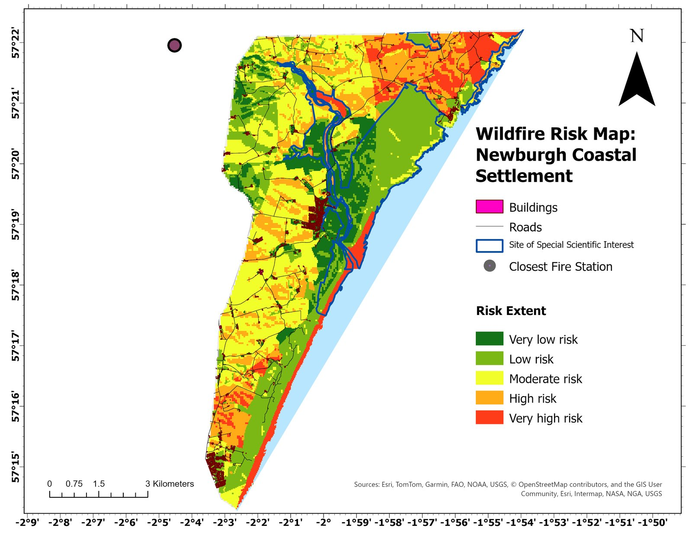
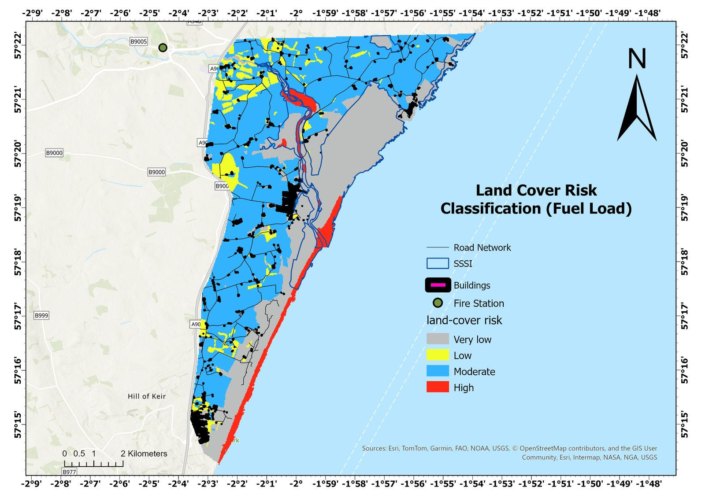
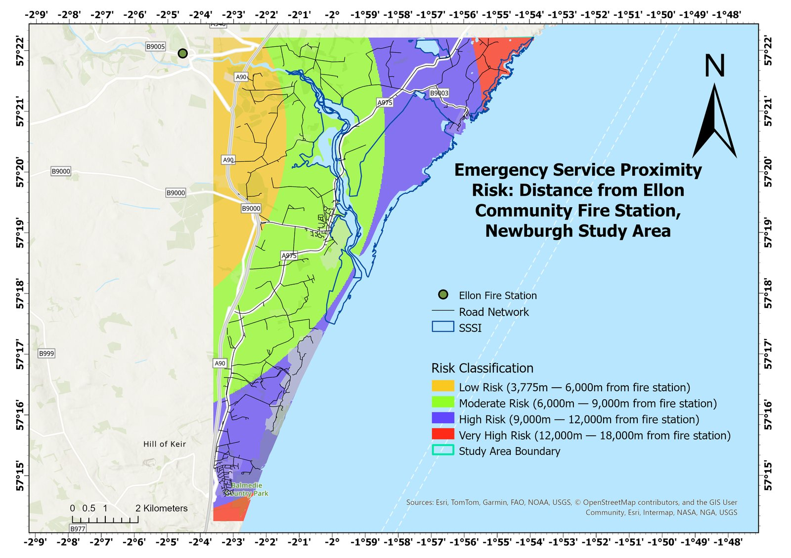
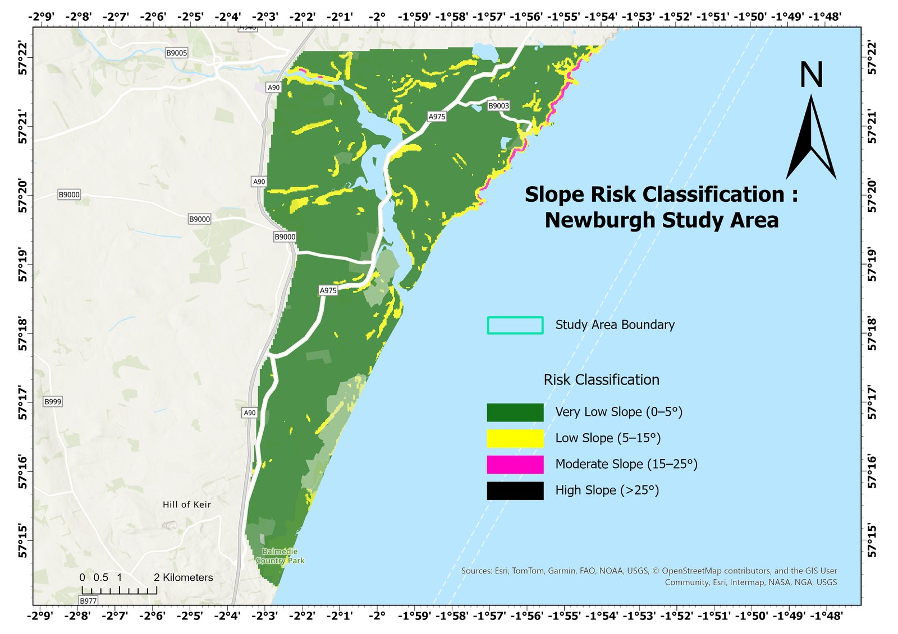
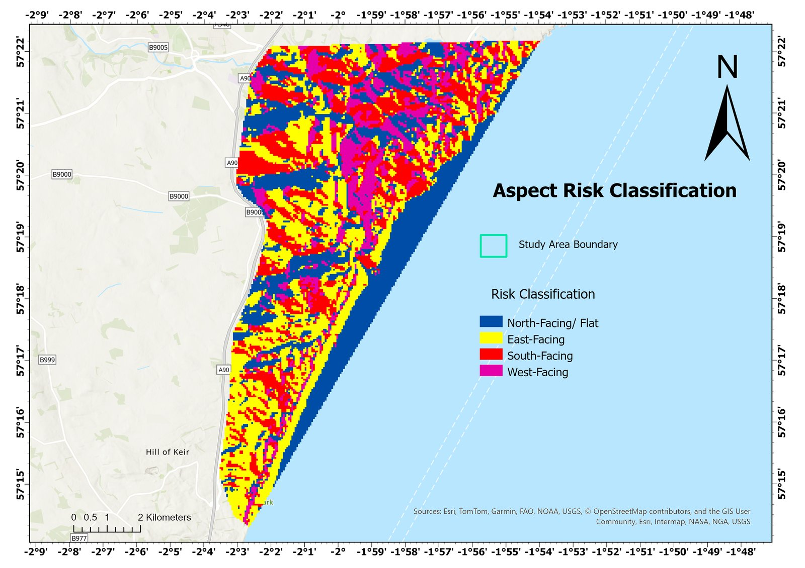
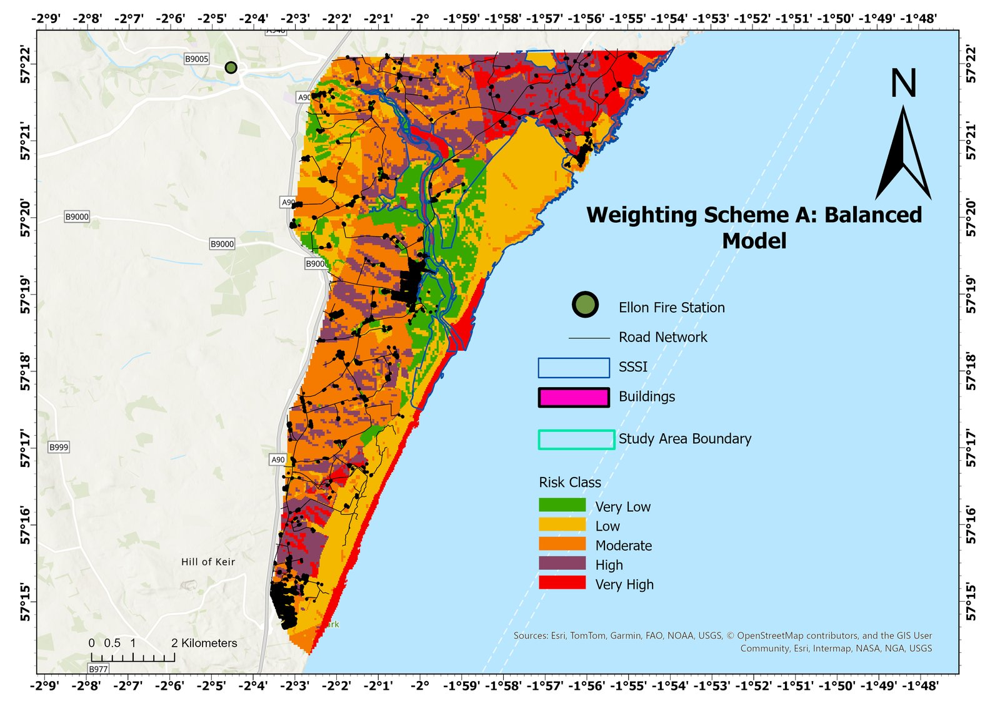
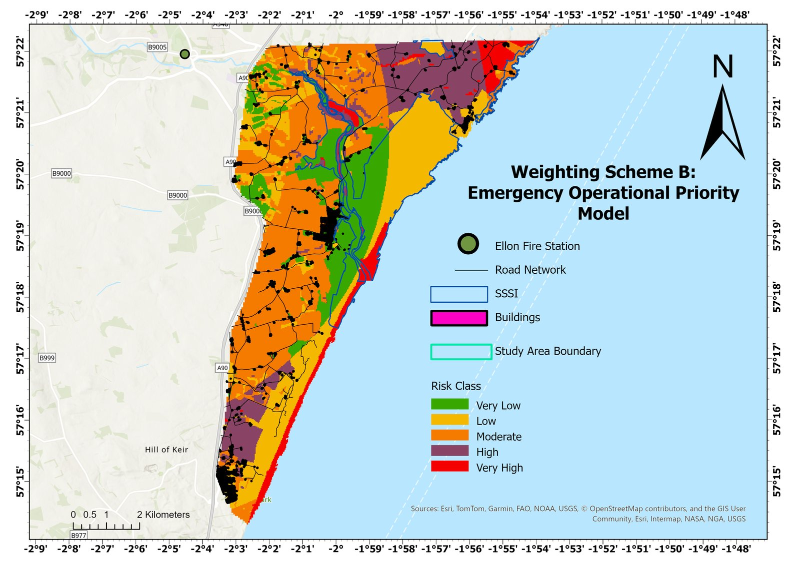
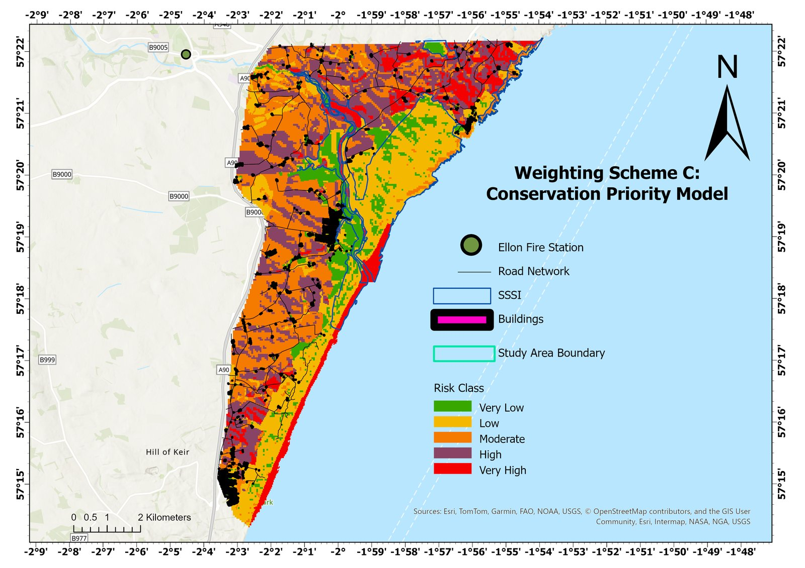
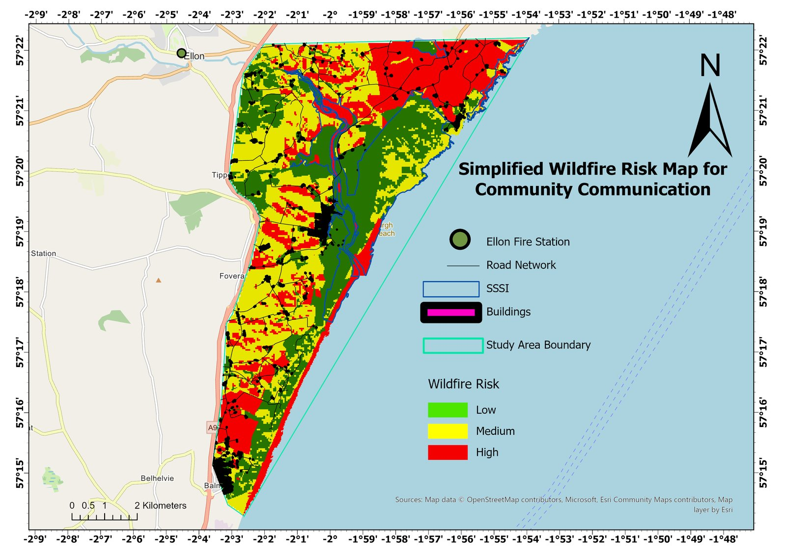

# Wildfire risk to a coastal settlement: Newburgh, Aberdeenshire

A GIS multicriteria assessment of wildfire risk around Newburgh and the Forvie National Nature Reserve, built in ArcGIS Pro with ArcPy using open UK datasets. Coursework for GG5540 Current Applications of GIS, MSc GIS and Remote Sensing, University of Aberdeen (May 2026).

## Why Newburgh

Wildfire research in Scotland has concentrated on upland moorland, but coastal dune systems carry many of the same risk factors. Newburgh sits directly beside the Sands of Forvie, the fifth largest dune system in Britain, with dry dune grassland and bare sand within a few hundred metres of homes. The nearest full-time fire station, at Ellon, is about 9 km away. No GIS wildfire assessment had been published for this stretch of coast.

## Data

All inputs were standardised to British National Grid (EPSG:27700).

| Dataset | Source | Use |
|-|-|-|
| Land Cover Map 2021 (25 m) | UKCEH | Vegetation fuel load |
| OS Terrain 50 DEM | Ordnance Survey OpenData | Slope and aspect |
| OS OpenMap Local (NJ, NK tiles) | Ordnance Survey OpenData | Buildings and roads |
| Boundary-Line | Ordnance Survey OpenData | Administrative context |
| SSSI boundaries | NatureScot | Protected site overlay |
| Fire station locations | Digitised from verified BNG coordinates | Emergency service distance |

## Method

1. Mosaicked the OS Terrain 50 tiles, merged the NJ and NK OpenMap Local layers and clipped every input to a digitised study area boundary (ArcPy `MosaicToNewRaster`, `Merge`, `Clip`).
2. Built four risk factors and reclassified each to a 1 to 5 scale:
   - **Fuel load** from land cover classes, with heath and dune grassland scored highest and urban land lowest
   - **Slope** in five bands from 0–5° up to over 35°
   - **Aspect**, scoring south and west facing ground highest for solar drying
   - **Distance from Ellon fire station** as a Euclidean surface in 3 km bands up to 18 km
3. Combined them by weighted sum: land cover 40%, fire station distance 30%, slope 20%, aspect 10%.
4. Tested the result under two alternative weighting schemes, one operational (fuel load and distance raised) and one conservation focused (slope and aspect raised).
5. Overlaid buildings, roads and the SSSI boundary, and produced a simplified three-class map for communicating with residents.

| Land cover fuel load | Distance from Ellon fire station |
|-|-|
|  |  |
| **Slope** | **Aspect** |
|  |  |

## Findings

- Composite risk ranges from 1.3 to 3.9. The highest values form a continuous band along the Forvie coastline, where the most combustible ground is also furthest from the fire station (roughly 9 to 18 km).
- About 28 per cent of the study area falls in the high or very high classes, and the very high zone lies entirely inside the Ythan Estuary, Sands of Forvie and Meikle Loch SSSI.
- Homes in Newburgh sit 150 to 300 m from the highest-risk ground, and no vehicle access reaches into the dune system.
- Farmland west of the A975 scores low (1.3 to 2.0) because of lower fuel continuity and better access.
- The coastal high-risk band appears under all three weighting schemes, so the main result does not depend on the chosen weights.

| Scheme A: balanced | Scheme B: operational | Scheme C: conservation |
|-|-|-|
|  |  |  |

## Limitations

- Dwarf shrub heath, the most fire-prone class in the literature, does not appear in LCM2021 at 25 m here, so fuel load is probably understated on the dunes.
- OS Terrain 50 smooths small dune features.
- Distance to the fire station is straight-line, not travel time along the road network. A Network Analyst service area would be the natural next step.
- Wind and fire weather are not modelled, so the map shows where the landscape is predisposed to fire, not how a given fire would behave.

