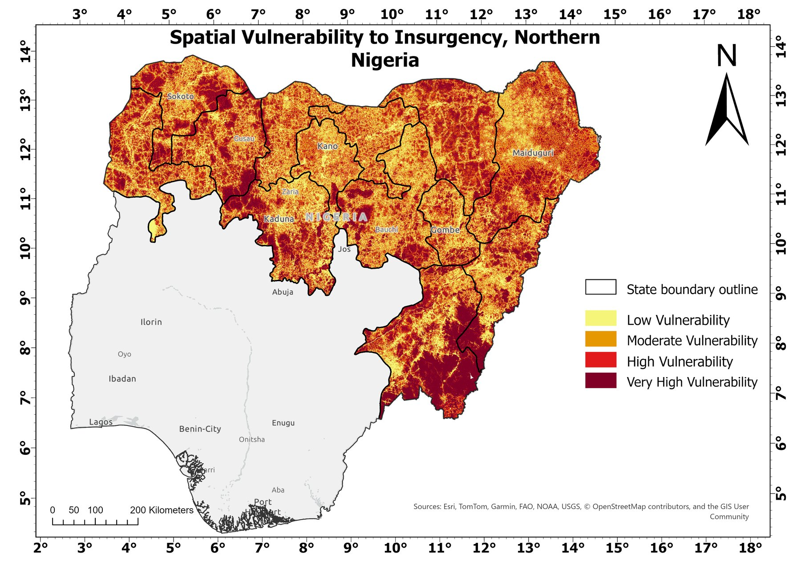
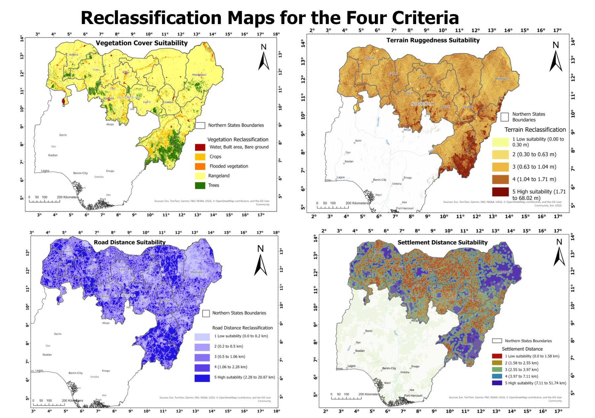
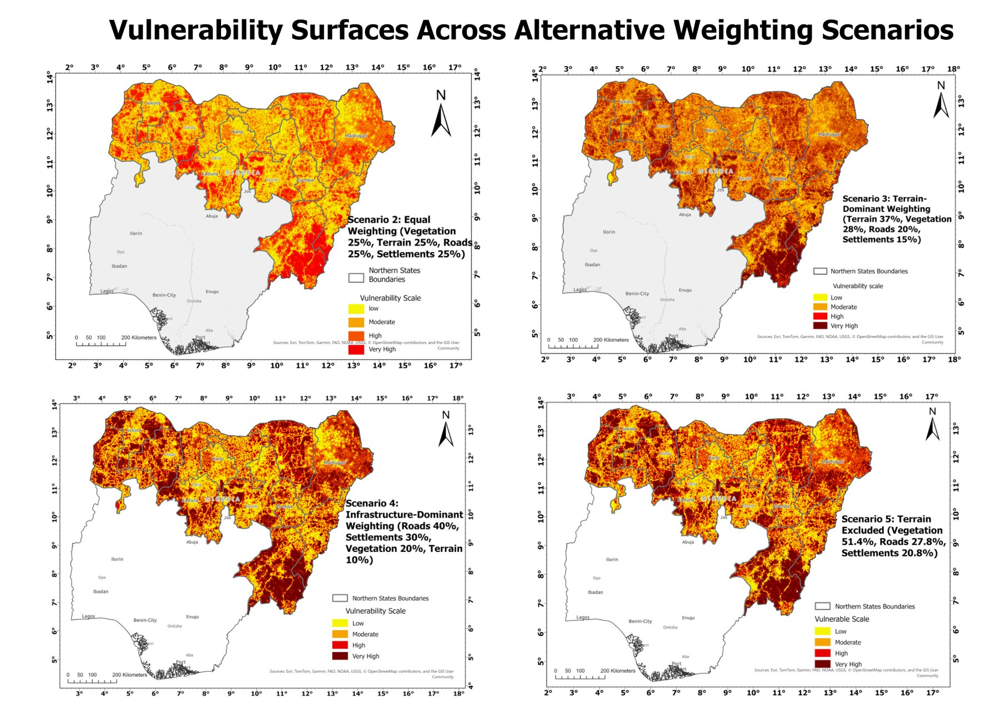
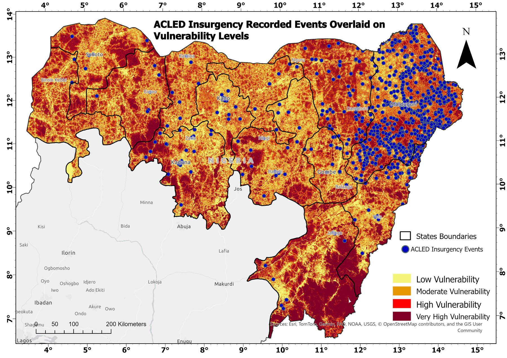
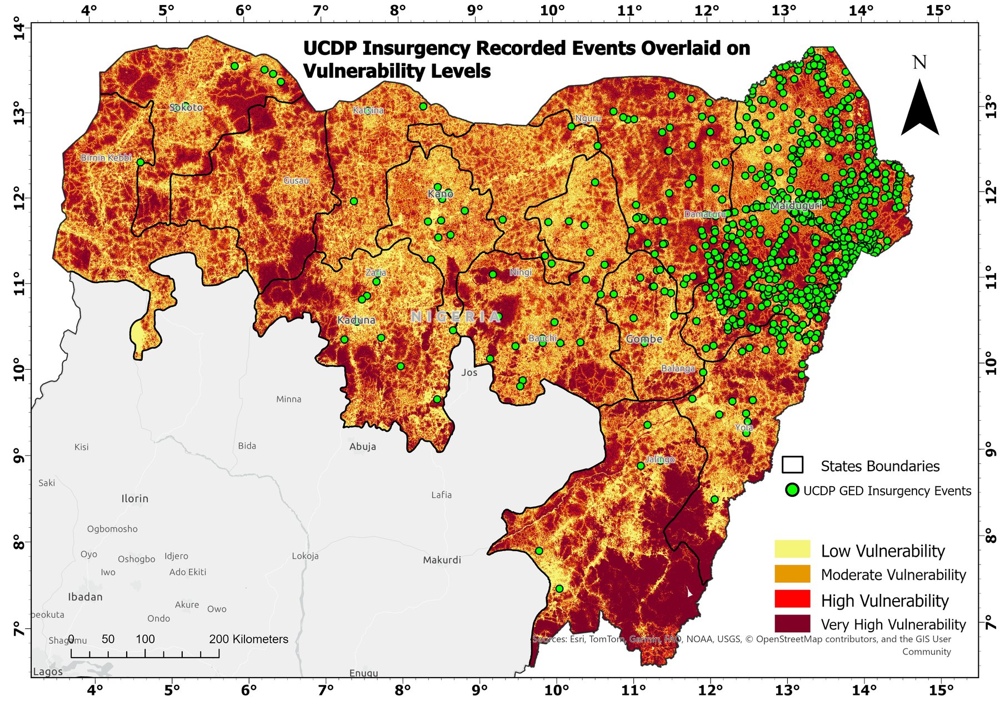

# Spatial vulnerability to insurgency in northern Nigeria

MSc dissertation, GIS and Remote Sensing, University of Aberdeen (2026). A multicriteria GIS model of where the physical environment favours insurgent concealment and movement across 13 states of northern Nigeria, built as a complete ArcPy workflow in ArcGIS Pro.



## Question

GIS work on insurgency in Nigeria has mostly mapped where attacks have already happened. This project asks a different question: which environments make insurgent operation easier, whether or not attacks have been recorded there?

## Method

- **Study area.** 13 northern states, processed in Africa Albers Equal Area Conic (ESRI 102022) at 100 m resolution. Every raster step is masked to the true state boundary rather than a bounding rectangle, which had silently added about 50 per cent extra territory in early runs.
- **Criteria.** Four physical factors, each reclassified to a 1 to 5 suitability scale with Jenks natural breaks:

  | Criterion | Source | AHP weight |
  |-|-|-|
  | Vegetation cover | Esri Sentinel-2 10 m land cover 2023 (Living Atlas) | 0.37 |
  | Terrain ruggedness (TRI) | SRTM 1 arc-second DEM | 0.28 |
  | Distance from roads | OpenStreetMap via HOT / HDX | 0.20 |
  | Distance from settlements | WorldPop 2020 constrained population | 0.15 |

- **Weighting.** AHP pairwise comparison, with a consistency ratio well inside Saaty's 0.10 threshold.
- **Sensitivity testing.** Four alternative scenarios: equal weights, terrain dominant, infrastructure dominant, and one with terrain removed entirely. Agreement between the surfaces was measured with Spearman rank correlation and the share of cells that stayed in the same class.
- **Validation.** Two independent conflict event datasets (ACLED, 5,873 events; UCDP GED, 4,367 events), filtered to insurgent actors and relevant event types. Zonal concentration ratios, an AUC statistic against random pseudo-absence points, stratified tests by fatality and event type, and a reserve-level check against forest reserves documented as insurgent or bandit bases.



## Findings

- **Three consistent high-vulnerability zones:** the Zamfara reserve corridor (vegetation and distance from roads), the Gashaka-Gumti highlands (terrain ruggedness), and the rural Borno–Yobe border (distance from roads and settlements). Taraba State scores high under every scenario, including the one without terrain.
- **The surface is stable to reweighting.** The three other original scenarios correlate with the primary AHP model at Spearman rho 0.78 to 0.95. Removing terrain entirely shifts the result the most (rho 0.72, 49.9 per cent of cells unchanged).
- **Recorded attacks sit in the opposite places.** The low-vulnerability zone covers about a quarter of the study area but holds 77.5 per cent of ACLED events and 61.1 per cent of UCDP events, giving AUC values well below 0.5. Attacks cluster in accessible areas near roads and settlements, where targets are.
- **The model does find operating bases.** Eleven of twelve reserves independently documented as insurgent or bandit bases score above the average for all reserves.

The conclusion is that environmental suitability for concealment, operational presence and recorded attacks are distinct stages in northern Nigeria. Incident data captures only the last of these, so an environment-led surface complements incident mapping by pointing to remote areas where activity is easily missed.



| ACLED events on the vulnerability surface | UCDP GED events on the vulnerability surface |
|-|-|
|  |  |

## Repository contents

```
northern-nigeria-vulnerability-model/
├── scripts/     16 ArcPy scripts, run in numbered order (see _workflow_notes.txt)
├── results/     Validation and state-level summary tables (CSV)
└── maps/        Final map outputs
```

| Script | Purpose |
|-|-|
| 01 | Select the 13 states, project to Albers, dissolve the boundary |
| 02 | Reproject SRTM and calculate the Terrain Ruggedness Index |
| 03 | Road distance, and settlement patches from WorldPop (≥ 50 people/km², ≥ 1 km²) |
| 04 | Download, mosaic and reproject Sentinel-2 land cover tiles |
| 05–06 | Import ACLED and UCDP GED and filter to insurgent events |
| 07 | Reclassify all four criteria to a 1 to 5 scale |
| 08 | AHP weighted overlay, scenarios 1 to 4 |
| 09 | Quantile classes and the scenario agreement map |
| 10–11 | Zonal and AUC validation, then stratified validation |
| 12–13 | State-level statistics and criterion values at event locations |
| 14 | Scenario 5, terrain removed |
| 15 | Reserve-level consistency test, corrected for spatial autocorrelation |
| 16 | Spearman agreement between scenarios |

Each script sets its own `ROOT_PATH`; change it to your project folder before running. Scripts need ArcGIS Pro with the Spatial Analyst extension.

Raw data is not included. ACLED's terms do not allow redistribution, and the other inputs are large. All sources are listed above and are free or available through ArcGIS Living Atlas.

## Limitations

- SRTM vertical noise is significant in the flat northwest, so the terrain signal there is weak. Scenario 5 tests how much this matters.
- OpenStreetMap roads treat every route as equal, so the model overstates access where only motorcycles and bush tracks connect places.
- WorldPop 2020 does not reflect recent displacement, and Nigeria's last census was in 2006.
- A weighted overlay lets a high score on one criterion offset a low score on another. Non-compensatory methods are a sensible next step.

## Data sources

ACLED (Armed Conflict Location & Event Data); UCDP Georeferenced Event Dataset; Esri Land Cover 2023 (Impact Observatory, Karra et al., 2021); NASA/USGS SRTM 1 Arc-Second DEM; Humanitarian OpenStreetMap Team Nigeria roads via HDX; WorldPop 2020 constrained population; GADM administrative boundaries.
